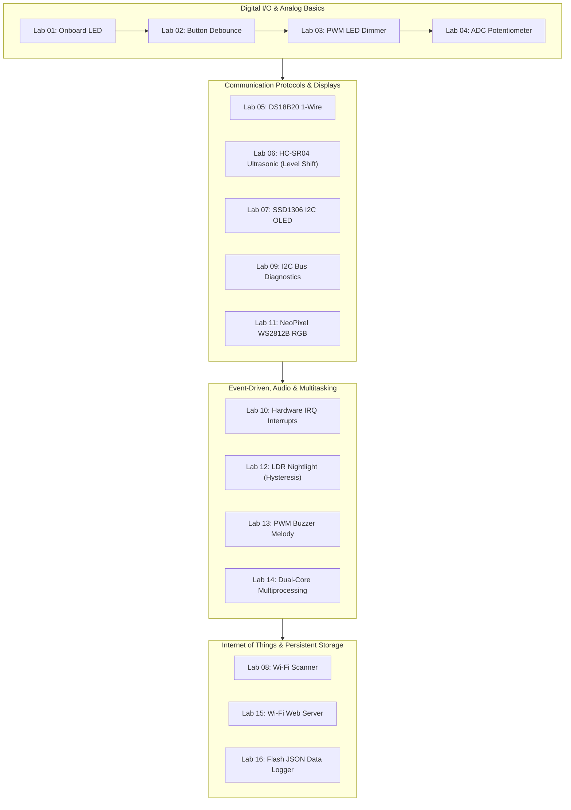

# MicroPython Embedded Systems Laboratory Course
### Hands-On Firmware Engineering with Raspberry Pi Pico & Pico 2 W


A comprehensive, industry-aligned laboratory course teaching embedded systems fundamentals, microcontroller interfacing, physical sensor protocols, real-time multitasking, and IoT communication using MicroPython.

---

## Course Navigation

- **Master Textbook Tutorial**: [TUTORIAL.md](TUTORIAL.md) *(Complete circuit schematics, physics of sensors, code breakdowns, and troubleshooting)*
- **Laboratory Reference Cards**: [outputs/EXPERIMENTS.md](outputs/EXPERIMENTS.md) *(Quick parts lists, wiring tables, and challenges)*
- **Source Code Library**: [outputs/experiments/](outputs/experiments/) *(All 16 self-contained runnable MicroPython scripts)*

---

## Laboratory Curriculum Roadmap



---

## 16 Hands-On Experiments

| Experiment | Filename | Key Hardware / Concept |
|---|---|---|
| **01 — On-board LED Heartbeat** | [`01_blink_led.py`](outputs/experiments/01_blink_led.py) | Push-pull GPIO, duty cycle, memory-safe loops |
| **02 — Button Input & Debounce** | [`02_button_debounce.py`](outputs/experiments/02_button_debounce.py) | High-impedance, internal pull-up, switch bounce settling |
| **03 — PWM LED Breathing Light** | [`03_pwm_breathe.py`](outputs/experiments/03_pwm_breathe.py) | Pulse Width Modulation, average power, human eye response |
| **04 — Potentiometer ADC Meter** | [`04_adc_potentiometer.py`](outputs/experiments/04_adc_potentiometer.py) | SAR ADC quantization, voltage scaling, ASCII bargraphs |
| **05 — DS18B20 1-Wire Thermometer** | [`05_ds18b20_temperature.py`](outputs/experiments/05_ds18b20_temperature.py) | Dallas 1-Wire open-drain bus, 4.7 k$\Omega$ pull-up, ROM scanning |
| **06 — Ultrasonic Distance Meter** | [`06_ultrasonic_distance.py`](outputs/experiments/06_ultrasonic_distance.py) | Acoustic time-of-flight, 5V-to-3.3V voltage divider |
| **07 — I2C OLED Dashboard** | [`07_oled_dashboard.py`](outputs/experiments/07_oled_dashboard.py) | I2C synchronous bus, frame buffer graphics, SSD1306 driver |
| **08 — Wi-Fi Network Scanner** | [`08_wifi_scan.py`](outputs/experiments/08_wifi_scan.py) | 802.11 b/g/n RF beacon scan, RSSI decibels, channel scan |
| **09 — I2C Bus Explorer** | [`09_i2c_explorer.py`](outputs/experiments/09_i2c_explorer.py) | 7-bit bus sniffing, ACK/NACK verification, hardware debugging |
| **10 — Hardware Interrupt Counter** | [`10_interrupt_counter.py`](outputs/experiments/10_interrupt_counter.py) | Edge-triggered IRQ, ISR rules (zero allocation, no blocking) |
| **11 — WS2812B / NeoPixel RGB** | [`11_neopixel_rgb.py`](outputs/experiments/11_neopixel_rgb.py) | 800 kHz single-wire timing, 24-bit GRB colors, rainbow wheel |
| **12 — LDR Nightlight with Hysteresis** | [`12_ldr_nightlight.py`](outputs/experiments/12_ldr_nightlight.py) | Analog voltage divider, Schmitt trigger hysteresis |
| **13 — PWM Buzzer Melody** | [`13_pwm_buzzer_melody.py`](outputs/experiments/13_pwm_buzzer_melody.py) | Frequency generation, musical pitch dictionary, tempo control |
| **14 — Dual-Core Multiprocessing** | [`14_multicore_threading.py`](outputs/experiments/14_multicore_threading.py) | RP2040/RP2350 dual-core scheduling with `_thread` |
| **15 — Wi-Fi Web Server** | [`15_wifi_web_server.py`](outputs/experiments/15_wifi_web_server.py) | Embedded TCP socket, HTTP request parsing, mobile web UI |
| **16 — Flash Filesystem Logger** | [`16_flash_filesystem_logger.py`](outputs/experiments/16_flash_filesystem_logger.py) | Non-volatile LittleFS flash storage, JSON state persistence |

---

## Getting Started

### 1. Hardware Requirements
* **Microcontroller**: Raspberry Pi Pico, Pico W, Pico 2, or Pico 2 W.
* **Cables**: Micro-USB data cable (ensure it supports data, not power-only).
* **Components Kit**:
  - Breadboard & male-to-male jumper wires
  - Momentary pushbuttons
  - 5mm LEDs & current-limiting resistors ($220\ \Omega\text{ to }330\ \Omega$)
  - $10\text{ k}\Omega$ rotary potentiometer
  - $10\text{ k}\Omega$ and $4.7\text{ k}\Omega$ resistors
  - DS18B20 digital temperature sensor
  - HC-SR04 ultrasonic distance sensor
  - SSD1306 $128\times 64$ I2C OLED display
  - WS2812B / NeoPixel RGB LED strip or ring
  - Light Dependent Resistor (LDR / Photoresistor)
  - Passive piezo buzzer

### 2. Software Installation
1. **Flash MicroPython Firmware**:
   - Download the latest UF2 from [micropython.org](https://micropython.org/download/RPI_PICO2_W/).
   - Hold the **BOOTSEL** button on the Pico while connecting USB.
   - Drag and drop the `.uf2` file onto the mounted `RPI-RP2` drive.
2. **Integrated Development Environment (IDE)**:
   - Download and install [Thonny IDE](https://thonny.org/).
   - Under **Run $\rightarrow$ Configure Interpreter**, select **MicroPython (Raspberry Pi Pico)**.
3. **Upload an Experiment**:
   - Open any experiment file (e.g. `outputs/experiments/01_blink_led.py`).
   - Click **Run current script (F5)** or save it to the board as `main.py` for standalone execution.

---

## Directory Structure

```
c:/music_python/
│
├── TUTORIAL.md               # Master Embedded Systems Engineering textbook
├── README.md                 # Project introduction and quick-start roadmap
├── .gitignore                # Git exclusions (.mpy, cache, temp)
│
├── outputs/
│   ├── README.md             # Experiments index and hardware map
│   ├── EXPERIMENTS.md        # Condensed experiment reference cards
│   │
│   └── experiments/          # 16 complete, tested MicroPython experiments
│       ├── 01_blink_led.py
│       ├── 02_button_debounce.py
│       ├── 03_pwm_breathe.py
│       ├── 04_adc_potentiometer.py
│       ├── 05_ds18b20_temperature.py
│       ├── 06_ultrasonic_distance.py
│       ├── 07_oled_dashboard.py
│       ├── 08_wifi_scan.py
│       ├── 09_i2c_explorer.py
│       ├── 10_interrupt_counter.py
│       ├── 11_neopixel_rgb.py
│       ├── 12_ldr_nightlight.py
│       ├── 13_pwm_buzzer_melody.py
│       ├── 14_multicore_threading.py
│       ├── 15_wifi_web_server.py
│       ├── 16_flash_filesystem_logger.py
│       └── ssd1306.py        # MicroPython SSD1306 OLED driver
│
└── scripts/
    └── create_github_repo.py # Helper script to create & push to private GitHub repo
```

---

## License & Attribution

This course material is distributed under the **MIT License**. Created for embedded systems educators, hobbyists, and university students.
